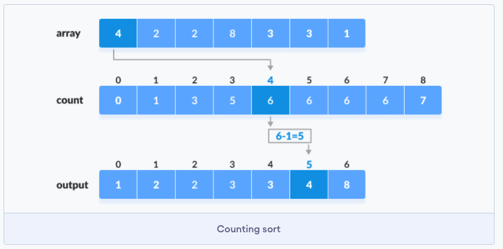

# Counting-Sort-Algorithm
<h2> Definition </h2>  
<pre>
The lower bound nlogn does not apply to algorithms that do not compare array
elements but use some other information. An example of such an algorithm is
counting sort that sorts an array in O(n) time assuming that every element in
the array is an integer between 0... c and c = O(n).

The algorithm creates a bookkeeping array, whose indices are elements of the
original array. The algorithm iterates through the original array and calculates
how many times each element appears in the array.

Construction of the bookkeeping array takes O(n) time. After this, the sorted
array can be created in O(n) time because the number of occurrences of each
element can be retrieved from the bookkeeping array. Thus, the total time
complexity of counting sort is O(n).

Counting sort is a very efficient algorithm but it can only be used when the
constant c is small enough, so that the array elements can be used as indices in
the bookkeeping array
</pre>
<h2> Visual Algorithm </h2>

